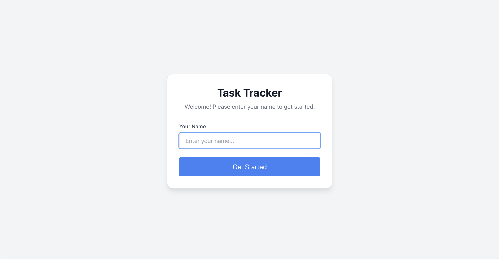

# Personal Task Tracker

## 📖 Description
A basic, responsive personal task management app built with React and TypeScript. Easily add, edit, filter, and manage your daily tasks with persistent local storage, keyboard shortcuts, and a clean UI. Designed for productivity and ease of use.

## 🚀 Features
- Login with username (stored in localStorage)
- Add, edit, delete, and toggle complete for tasks
- Task priority levels (Low, Medium, High)
- Task tags and due dates
- Filter by status (All, Completed, Pending) and priority
- Search tasks by title, description, or tag (with highlight)
- Delete confirmation modal
- Dark & Light theme toggle (with persistence)
- Keyboard shortcuts for quick actions
- Responsive design for mobile and desktop
- Data persistence with localStorage

## 🛠️ Setup Instructions
1. Clone the repository
2. Run
```
npm install
```
3. Run
```
npm start
```
4. Open [http://localhost:3000](http://localhost:3000)

## 🧰 Technologies Used
- React.js (with TypeScript)
- Tailwind CSS
- LocalStorage

## 🔗 Live Demo
[https://task-intern-drab.vercel.app/](https://task-intern-drab.vercel.app/)

## 🖼️ Screenshots
### Login Page


### Dashboard


### Add Task Modal

